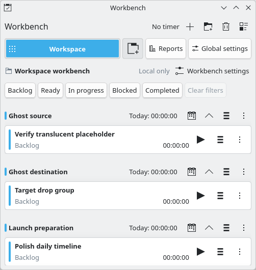
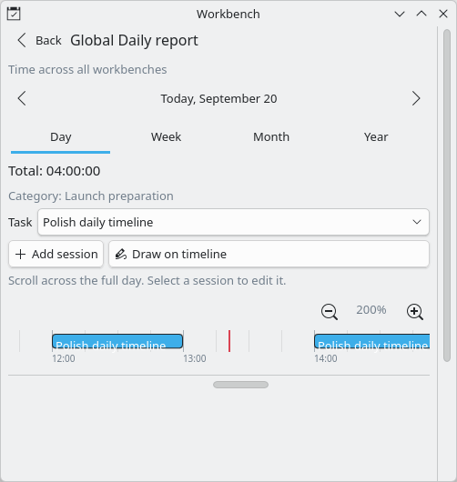
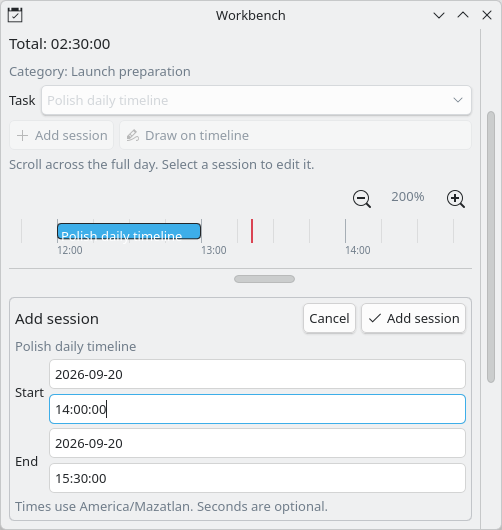
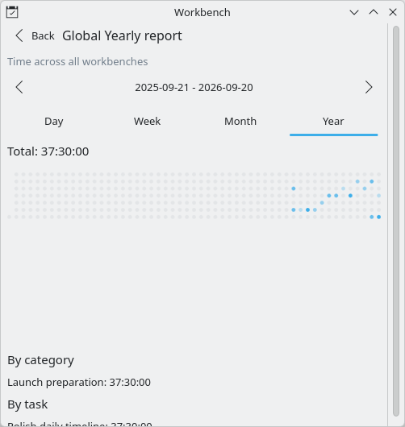
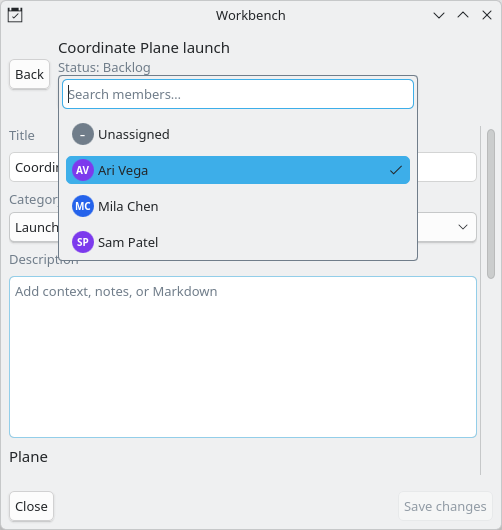

# Workbench

A card-based task manager and work-time tracker for KDE Plasma.

Workbench keeps tasks, status, tabbed workspaces, categories, tracked time, and work reports directly on the Plasma desktop.

The board hierarchy is `workspace tab → category → task`. This keeps contexts
such as Personal and Work separate while still allowing each workspace to use
its own project-oriented categories.

## Screenshots

| Task board | Daily timeline |
| --- | --- |
|  |  |
| Exact session editing | Rolling year heatmap |
|  |  |

### Plane task owner



## Build and Test

The data repository is QML JavaScript using `QtQuick.LocalStorage`. A small Qt 6 QML module supplies IANA timezone and daylight-saving-safe report calculations.

```sh
cmake -S . -B build -G Ninja
cmake --build build
ctest --test-dir build --output-on-failure
```

Run the opt-in 5,000-task / 100,000-session benchmark separately:

```sh
cmake --build build --target benchmark-repository
```

Use Qt 6 tooling explicitly on this system:

```sh
/usr/lib/qt6/bin/qmllint -I build/qml package/contents/ui/*.qml
/usr/lib/qt6/bin/qmltestrunner -import build/qml -input tests/qml
```

Run black-box plasmoid tests with KDE's Appium AT-SPI driver:

```sh
./scripts/setup-e2e.sh
cmake --build build --target e2e
```

The E2E environment uses an isolated XDG home, D-Bus session, and nested KWin
compositor. See [`tests/e2e/README.md`](tests/e2e/README.md) for dependencies,
artifacts, and test-authoring conventions.

Regenerate the README screenshots from the compact Appium fixture with:

```sh
./scripts/update-readme-screenshots.sh
```

Build the self-contained plasmoid, then create a release archive and install it with `kpackagetool6`:

```sh
cmake --build build --target package-plasmoid
kpackagetool6 --type Plasma/Applet --install build/plasma-workbench-0.1.0.plasmoid
```

The `package-plasmoid` target stages `package/`, uses a fixed `SOURCE_DATE_EPOCH`, and writes a ZIP-compatible `.plasmoid` whose root contains `metadata.json` and `contents/`. The native timezone module is placed in `package/contents/ui/time/` during the build and is included with the archive.

Use the convenience scripts for a user-scoped install, upgrade, or removal:

```sh
./scripts/install.sh
./scripts/update.sh
./scripts/remove.sh
```

## Plane integration

Plane is an optional extension of an independent local workbench. Local
workbenches, categories, tasks, time tracking, reports, and workflows remain
available without a Plane connection.

From a workbench's **Workbench settings**, choose **Add Plane** and provide the
Plane API URL, workspace slug, and personal access token. The token is kept in
KWallet rather than Workbench's LocalStorage database. Then refresh Plane
projects and map only the local categories that should synchronize; unmapped
categories remain local-only.

Each workbench owns its local workflow. Add any statuses your team needs,
mark terminal statuses as completing tasks, then map each discovered Plane
state to one of those local statuses. Mapping changes save to that workbench
immediately and remain in place when Plane metadata is refreshed.

Tasks in mapped categories can be created and updated in Plane, and **Sync
linked tasks** pulls assigned work after an assignee ID is configured. The task
owner picker uses the cached members for its mapped Plane project, so choosing
an owner is fast and works from the local cache; it updates the next task sync.

The legacy command-line importer remains available for a read-only Plane pull.
It imports assigned Plane work items into the `4leaflabs` workspace without
changing Plane. It previews changes unless `--apply` is supplied, preserves
work sessions, and records stable Plane IDs so repeated pulls do not create
duplicates.

Use a normalized JSON snapshot:

```sh
./scripts/sync-plane.py assigned-items.json
./scripts/sync-plane.py assigned-items.json --apply
```

For a live read-only pull, keep the Plane personal access token in the process
environment rather than in the repository or widget configuration:

```sh
PLANE_API_KEY='plane_api_…' ./scripts/sync-plane.py \
  --assignee USER_UUID
PLANE_API_KEY='plane_api_…' ./scripts/sync-plane.py \
  --assignee USER_UUID --apply
```

The script has no Plane write path. Local edits to linked tasks are marked as
pending instead of being overwritten; simultaneous local and remote edits are
marked as conflicts.

## Compatibility

The Plasma package and LocalStorage database identifier remains
`io.github.ownisticapps.worktodo` so upgrades retain existing widgets, settings,
tasks, tracked time, categories, and reports. This legacy technical identifier is
not the repository slug; release archives and repository references use
`plasma-workbench`.

## License

Copyright (C) 2026 OwnisticApps. Workbench is licensed under the
[GNU Lesser General Public License, version 3 or later](LICENSE).
The release archive includes the canonical LGPL text, its incorporated GPL
terms, notices, and the exact corresponding source used to build its native
module. See
[SOURCE_OFFER.md](SOURCE_OFFER.md) and [THIRD_PARTY_NOTICES.md](THIRD_PARTY_NOTICES.md).

With `kpackagetool6` available at configure time, run the isolated archive-install smoke test after building the release target:

```sh
ctest --test-dir build -R plasmoid-archive-install --output-on-failure
```

Install `plasma-sdk` before visual testing with `plasmoidviewer`.

## Documentation

- [PRD.md](PRD.md): Product requirements and acceptance criteria.
- [KDE_PLASMA_API.md](KDE_PLASMA_API.md): Plasma 6, Kirigami, KConfig, and chart APIs.
- [QT_QML_API.md](QT_QML_API.md): QML, model, drag, timer, and SQLite guidance.
- [PERSISTENCE_AND_REPORTING.md](PERSISTENCE_AND_REPORTING.md): Schema, transitions, and report rules.
- [DEVELOPMENT_GUIDE.md](DEVELOPMENT_GUIDE.md): Environment, tests, and release workflow.
- [REFERENCES.md](REFERENCES.md): Primary upstream references.
